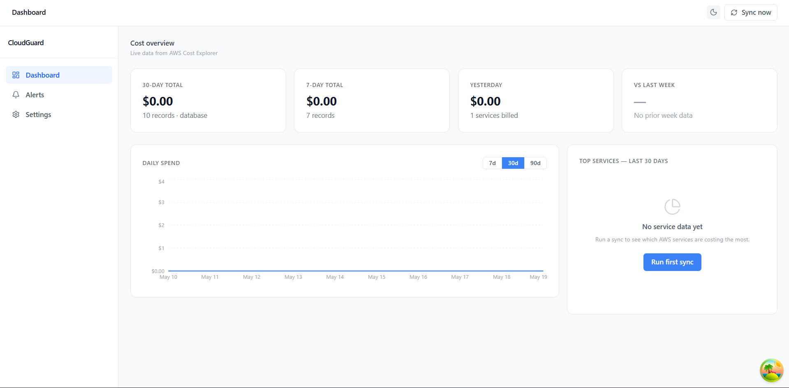
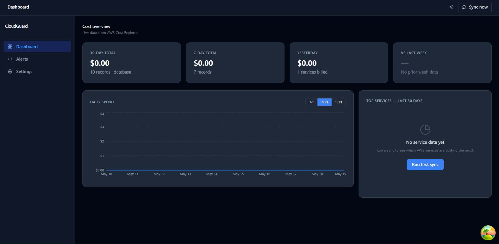
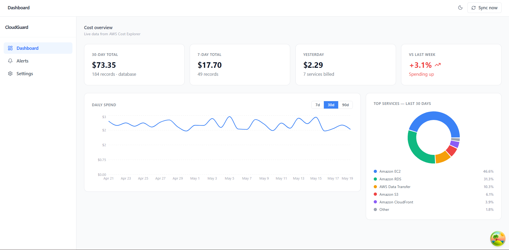

# CloudGuard

> **See what AWS is costing you — and where it's being wasted — on one dashboard, without ever opening the AWS console.**

[](https://github.com/mazkar-224/cloudguard-fyp/actions/workflows/ci.yml)
&nbsp;·&nbsp; **Live demo:** https://cloudcostguard-fyp.duckdns.org
&nbsp;·&nbsp; **API docs (Swagger):** https://cloudcostguard-fyp.duckdns.org/api/v1/docs

CloudGuard is a self-hosted AWS cost-monitoring tool. You sign up, paste in a set
of **read-only** AWS credentials, and CloudGuard pulls your spending from AWS Cost
Explorer, stores it in PostgreSQL, and serves it to a React dashboard. On top of
the raw numbers it **detects spending anomalies** (statistical spikes, with email
alerts) and **scans for wasted resources** (idle instances, unattached disks,
unused IP addresses) with an estimated monthly saving for each.

It runs as a four-container Docker stack and is deployed live on a single AWS EC2
instance behind automatic HTTPS.

> Final-year BSCS capstone project. The goal: a fully functional, self-hosted
> alternative to the AWS billing console that a small team can stand up in minutes.

---

## Screenshots



| Dark mode | Charts (real data) | Empty state |
|-----------|--------------------|-------------|
|  |  |  |

---

## Features

- 🔐 **Multi-user accounts** — email + password sign-up, JWT-secured sessions; every data endpoint is behind auth.
- 🔑 **Bring-your-own AWS keys** — paste read-only credentials in Settings; they're validated against AWS before saving and stored **encrypted at rest** (Fernet). The secret is never shown again (masked to last-4).
- 📊 **Cost dashboard** — 30-day / 7-day / yesterday / week-over-week summary cards, a daily-spend line chart (7/30/90-day), and a per-service breakdown donut.
- 🚨 **Anomaly detection** — a z-score detector flags account-level and per-service spending spikes against a rolling baseline, persists them as alerts, and emails you (via SendGrid) when configured.
- 💸 **Waste scanner & recommendations** — finds unattached EBS volumes, unassociated Elastic IPs, stopped instances, old snapshots, and idle running instances (CloudWatch CPU), each priced with an approximate monthly saving and ranked by dollar impact.
- ⏰ **Automatic background jobs** — APScheduler syncs costs every 6 hours and scans resources daily; both can be triggered on demand.
- 🐳 **Production-ready** — multi-stage Docker images, PostgreSQL with a persistent volume, Caddy reverse proxy with auto-renewing Let's Encrypt TLS.
- ✅ **CI on every push** — GitHub Actions runs the full test suite (**100 tests, 82% coverage**) and a frontend lint + build.

---

## Architecture at a glance

```
                          ┌──────────────┐
                          │   Browser     │   signed-in user
                          └──────┬────────┘
                                 │ HTTPS
                                 ▼
                    ┌──────────────────────────┐
                    │  Caddy  (reverse proxy)   │  auto TLS · :80→:443 · HSTS
                    └────────────┬──────────────┘
                                 ▼
                    ┌──────────────────────────┐
                    │  Frontend container       │  React SPA build served by
                    │  nginx  (serves UI +      │  nginx; proxies /api → backend
                    │  proxies /api → backend)  │
                    └────────────┬──────────────┘
                                 │ /api/v1  (same origin)
                                 ▼
        ┌────────────────────────────────────────────────────┐
        │  Backend container — FastAPI (uvicorn, 1 worker)    │
        │                                                     │
        │  JWT auth (bcrypt) ── guards every data endpoint    │
        │  Routers: costs · alerts · recommendations ·        │
        │           settings · admin · health · auth          │
        │                                                     │
        │  APScheduler (in-process):                          │
        │    • cost_sync       every  6h                      │
        │    • resource_scan   every 24h                      │
        │                                                     │
        │  Services: AwsCostService · ResourceScanner ·       │
        │    anomaly_detector · savings_estimator ·           │
        │    email_service · crypto (Fernet) · auth_service   │
        └───┬─────────────────────────────────┬──────────────┘
            │ SQLAlchemy async (asyncpg)       │ boto3 (asyncio.to_thread)
            ▼                                  ▼
   ┌────────────────────┐            ┌──────────────────────────┐
   │  PostgreSQL 16     │            │   AWS APIs                │
   │  (volume-backed)   │            │   Cost Explorer · STS     │
   │                    │            │   EC2 · CloudWatch        │
   │  users             │            └──────────────────────────┘
   │  aws_credentials   │
   │  aws_accounts      │            ┌──────────────────────────┐
   │  cost_records      │            │  SendGrid  (email alerts) │
   │  alerts            │            └──────────────────────────┘
   │  recommendations   │
   └────────────────────┘
```

📐 A detailed component-and-data-flow write-up is in **[docs/ARCHITECTURE.md](docs/ARCHITECTURE.md)**.

---

## Tech stack

| Layer | Technology |
|-------|------------|
| Frontend | React 19, Vite, Tailwind CSS v4, Recharts, TanStack React Query v5, Axios, React Router 7 |
| Backend | Python 3.12, FastAPI 0.115, SQLAlchemy 2.0 (async), Alembic, APScheduler 3 |
| Auth & crypto | PyJWT, bcrypt (passwords), `cryptography` Fernet (AWS-secret encryption at rest) |
| Database | PostgreSQL 16, asyncpg driver |
| AWS | boto3 · Cost Explorer · STS · EC2 · CloudWatch |
| Email | SendGrid |
| Packaging & deploy | Docker (multi-stage), Docker Compose, nginx, Caddy (auto-TLS), AWS EC2 (Ubuntu) |
| CI/CD & tooling | GitHub Actions, Pytest + coverage, ESLint, Prettier, moto |

---

## Quick start (local development)

**Prerequisites:** Docker, Python 3.12+, Node.js 20+.

```bash
git clone https://github.com/mazkar-224/cloudguard-fyp.git
cd cloudguard

# 1. Environment files
cp .env.example .env                 # Postgres credentials for Docker Compose
cp backend/.env.example backend/.env # backend secrets (see notes below)

# 2. Start PostgreSQL (+ pgAdmin)
docker compose up -d

# 3. Backend
cd backend
python3 -m venv venv && source venv/bin/activate   # Windows: venv\Scripts\activate
pip install -r requirements-dev.txt
alembic upgrade head

# 4. Frontend
cd ../frontend
npm install
```

Then start everything with one command from the repo root:

```bash
bash scripts/dev.sh        # Windows: scripts\dev.bat
```

| Service | URL |
|---------|-----|
| Dashboard | http://localhost:5173 |
| API | http://localhost:8000 |
| Swagger UI | http://localhost:8000/api/v1/docs |
| pgAdmin | http://localhost:5050 |

> **`backend/.env` needs:** `DATABASE_URL`, a `SECRET_KEY`, and (for AWS data) `AWS_ACCESS_KEY_ID` / `AWS_SECRET_ACCESS_KEY`. Generate an `ENCRYPTION_KEY` for the Settings feature with
> `python -c "from cryptography.fernet import Fernet; print(Fernet.generate_key().decode())"`.
> The minimum IAM permission for cost data is `ce:GetCostAndUsage`; the waste scanner additionally uses read-only EC2 + CloudWatch describe/list calls (the AWS-managed **ReadOnlyAccess** policy covers all of it). See `backend/.env.example`.

First run only: create an account at `/register`, then add your AWS keys on the **Settings** page.

---

## Production deployment

The whole stack runs from **`docker-compose.prod.yml`** (PostgreSQL + backend + nginx-frontend + Caddy) driven by a single `.env.prod`. Caddy obtains and renews a Let's Encrypt certificate automatically once a real hostname points at the server.

```bash
# on the server, with .env.prod filled in:
docker compose -f docker-compose.prod.yml up -d --build
docker compose -f docker-compose.prod.yml exec backend alembic upgrade head
```

The full click-by-click runbook — EC2 launch, security-group rules, DNS, billing alarm, and teardown — is in **[docs/deploy.md](docs/deploy.md)**. CloudGuard is currently deployed this way at **https://cloudcostguard-fyp.duckdns.org**.

---

## API reference

All endpoints are under `/api/v1`. Everything except `/health` and `/auth/*` requires a `Bearer` token from `/auth/login`.

| Method | Path | Purpose |
|--------|------|---------|
| `GET` | `/health` | Liveness + version + environment |
| `POST` | `/auth/register` | Create an account |
| `POST` | `/auth/login` | Get a JWT access token |
| `GET` | `/auth/me` | Current user |
| `GET` | `/costs/daily?days=30` | Daily total spend |
| `GET` | `/costs/by-service?start_date=…&end_date=…` | Per-service spend |
| `GET` | `/costs/summary?days=30` | Summary-card figures |
| `GET` | `/alerts?status=&severity=&days=&limit=&offset=` | Anomaly alerts (filter + paginate) |
| `GET` | `/alerts/count?days=30` | Alert counts by status/severity (sidebar badge) |
| `PATCH` | `/alerts/{id}` | Acknowledge an alert |
| `GET` | `/recommendations?resource_type=&status=` | Waste recommendations ($-ranked) |
| `GET` | `/recommendations/summary` | Total estimated monthly savings (hero banner) |
| `PATCH` | `/recommendations/{id}` | Dismiss / resolve a recommendation |
| `POST` | `/settings/test-connection` | Validate AWS keys without saving |
| `GET` / `POST` / `DELETE` | `/settings/aws-credentials` | Read (masked) / save (encrypted) / remove the user's AWS keys |
| `POST` | `/admin/sync` | Run a cost sync + detection now |
| `POST` | `/admin/scan-resources` | Run a waste scan now |

Interactive docs: **`/api/v1/docs`** (Swagger UI).

---

## Running tests

Tests run against a separate `cloudguard_test` database and mock AWS with `moto` — your real data and cloud account are never touched.

```bash
cd backend
venv/bin/python3 -m pytest tests/ -v                       # all tests
venv/bin/python3 -m pytest --cov=app --cov-report=term-missing tests/   # with coverage
```

**100 tests, ~82% coverage** (28 in Phase 3 · +24 Phase 4 · +33 Phase 5 · +15 Phase 6).

| File | What it tests |
|------|--------------|
| `test_health.py` | `/health` shape |
| `test_costs.py` | The three cost endpoints with seeded data |
| `test_admin_sync.py` | Sync endpoint — count + idempotency |
| `test_aws_cost.py` | `AwsCostService` error handling + parsing |
| `test_anomaly_detector.py` | Pure z-score algorithm (spikes, severity bands, dollar floor, edge cases) |
| `test_cost_sync.py` | Seeded baseline + spike → alert; idempotent re-run |
| `test_email_service.py` | SendGrid email — payload, escaping, failure handling (mocked) |
| `test_alerts_api.py` | Alerts list/count/acknowledge filters + 404 |
| `test_e2e_spike_to_alert.py` | Full pipeline spike → detection → alert → email → API |
| `test_resource_scanner.py` | Scanner validation, healthcheck, 4 finders + idle-CPU (moto + mocked CloudWatch) |
| `test_savings_estimator.py` | Offline pricing math, unknown type → $0 |
| `test_resource_scan.py` | Findings → priced recommendations; idempotent upsert |
| `test_recommendations_api.py` | Recommendations list/sort/summary/dismiss + 404/422 |
| `test_auth.py` | Register/login/me, password hashing, JWT verify, 401 gating |
| `test_settings_api.py` | Credential validate-before-save, encryption, masked read, delete |

---

## CI/CD

GitHub Actions, in `.github/workflows/`:

- **`ci.yml`** (every push + PR): a **backend** job runs `pytest --cov` against a PostgreSQL service container (AWS mocked, no secrets needed), and a **frontend** job runs `npm ci` → lint → build. A red run blocks merges when branch protection is on.
- **`deploy.yml`** (manual `workflow_dispatch`): SSHes into the EC2 box, pulls, and rebuilds the Compose stack. Manual-only until the box is set up as a git clone with the `EC2_*` repository secrets configured — see the workflow header and the secrets table below.

**Repository secrets** (CI needs none; these are for the optional deploy job):

| Secret | Purpose |
|--------|---------|
| `EC2_HOST` | Server IP / hostname |
| `EC2_USER` | SSH user (e.g. `ubuntu`) |
| `EC2_SSH_KEY` | Private key (full PEM) |
| `EC2_APP_DIR` | *(optional)* repo path on the box (default `~/cloudguard`) |

GitHub Actions is free for public repos (private repos get 2,000 min/month — far more than this project uses).

---

## Documentation

| Doc | What's in it |
|-----|--------------|
| [docs/USER_GUIDE.md](docs/USER_GUIDE.md) | Sign up → add read-only AWS keys → read the Dashboard, Alerts, and Recommendations screens |
| [docs/ARCHITECTURE.md](docs/ARCHITECTURE.md) | Every component, the data model, and how data flows end-to-end |
| [docs/deploy.md](docs/deploy.md) | Production deployment runbook (EC2 + Docker + Caddy) and teardown |
| [docs/anomaly-detection.md](docs/anomaly-detection.md) | How the z-score detector works, its limits, and a demo script |

---

## Project structure

```
cloudguard/
├── .github/workflows/       # CI (ci.yml) + manual deploy (deploy.yml)
├── docker-compose.yml       # local: Postgres + pgAdmin
├── docker-compose.prod.yml  # production: db + backend + frontend + caddy
├── Caddyfile                # reverse proxy + auto-TLS + security headers
├── scripts/                 # dev.sh / dev.bat one-command startup
├── docs/                    # USER_GUIDE, ARCHITECTURE, deploy, anomaly-detection, screenshots
├── frontend/
│   ├── Dockerfile           # multi-stage: Vite build → nginx
│   ├── nginx.conf           # serves SPA + proxies /api
│   └── src/
│       ├── auth/            # AuthContext (login/register/logout, token handling)
│       ├── components/      # Layout, Sidebar, StatCard, charts, ProtectedRoute, EmptyState
│       ├── hooks/           # React Query hooks (costs, alerts, recommendations, credentials, sync)
│       ├── lib/             # api.js — axios client + 401 interceptor
│       └── pages/           # Login, Register, Dashboard, Alerts, Recommendations, Settings
└── backend/
    ├── Dockerfile           # multi-stage, non-root uvicorn
    ├── app/
    │   ├── api/v1/          # auth, costs, alerts, recommendations, settings, admin, health
    │   ├── db/              # async engine + session
    │   ├── jobs/            # cost_sync (6h) + resource_scan (24h)
    │   ├── models/          # User, AwsCredential, AwsAccount, CostRecord, Alert, Recommendation
    │   ├── schemas/         # Pydantic request/response models
    │   ├── services/        # AwsCostService, ResourceScanner, anomaly_detector,
    │   │                    #   savings_estimator, email_service, crypto_service, auth_service
    │   ├── config.py        # Settings from environment
    │   └── main.py          # FastAPI app + lifespan (scheduler) + CORS
    ├── alembic/             # migrations
    ├── tests/               # 100-test Pytest suite
    └── requirements*.txt
```

---

## Phase roadmap

- [x] **Phase 1** — Project setup (Docker Compose + Postgres, FastAPI skeleton, first migration)
- [x] **Phase 2** — Backend cost API (boto3 Cost Explorer wrapper, 5 endpoints, 6-hour sync job)
- [x] **Phase 3** — React dashboard (summary cards, charts, dark mode, app shell)
- [x] **Phase 4** — Anomaly detection (z-score detector, alerts table + API + UI, SendGrid email)
- [x] **Phase 5** — Resource waste scanner & recommendations (5 finders, savings estimator, API + UI)
- [x] **Phase 6** — Auth, encrypted credentials, containerization, deployment & docs
  - **6.1** JWT auth (register/login/me, all endpoints gated) + frontend auth flow
  - **6.2** Per-user Fernet-encrypted AWS credentials + Settings page (validate-before-save, masked reads)
  - **6.3** Containerization — backend + frontend Dockerfiles, `docker-compose.prod.yml`
  - **6.4** Live deployment on AWS EC2 behind Caddy auto-TLS
  - **6.5** CI/CD with GitHub Actions + status badge
  - **6.6** Final documentation (this README, user guide, architecture doc, report map)

---

## Author & license

**Muhammad Azkar** — BSCS final-year project. Licensed under the MIT License.
